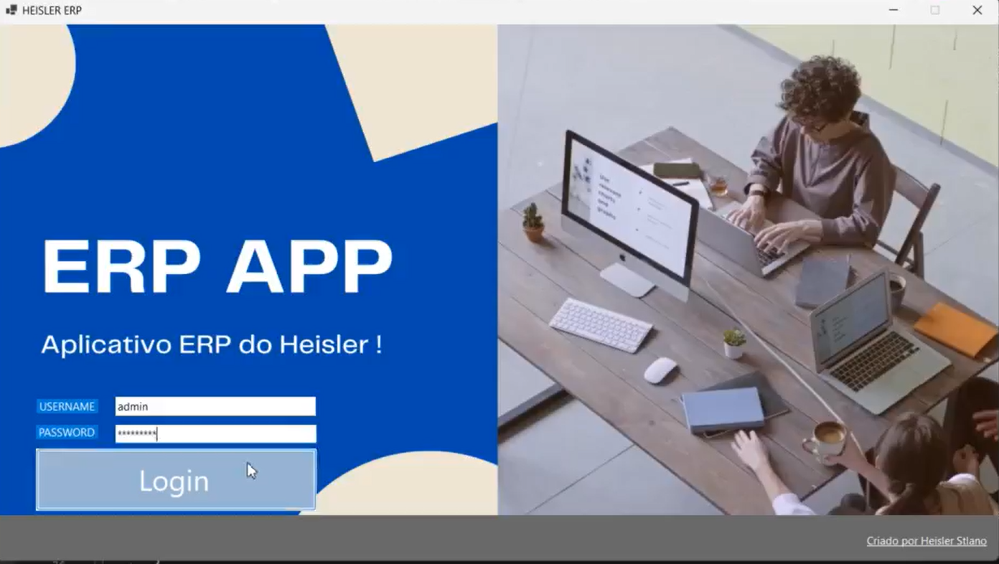

# Heisler ERP 



A enterprise resource planning for small to medium companys


Feature

Rh : Add and Monitor employeer information\
Warehouse : Add and Monitor stock assets\
Contability : Deposit and withdraw credit nad check the company blance\
Pos : Select item for checkout and emits a invoice\
Crm : See client  information and interation with the company

It has a local database and a API server 


## How to run

Open visual studio  and click run

If you want to track the logs

Go to the root folder

```bash
 cd /app
```
And type

```bash
  dotnet watch
```

